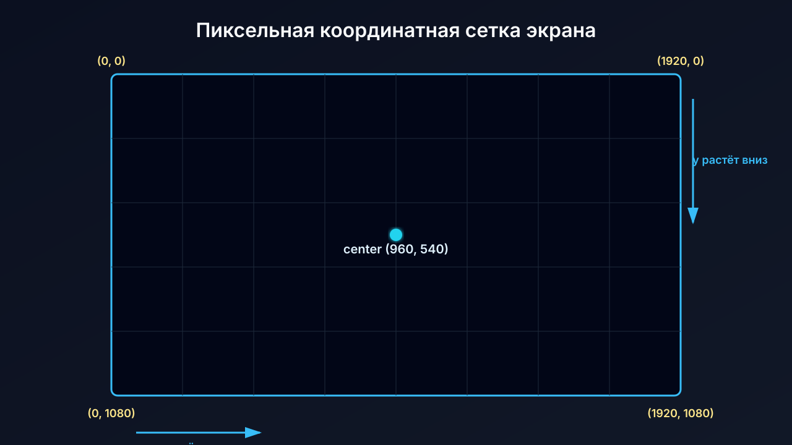
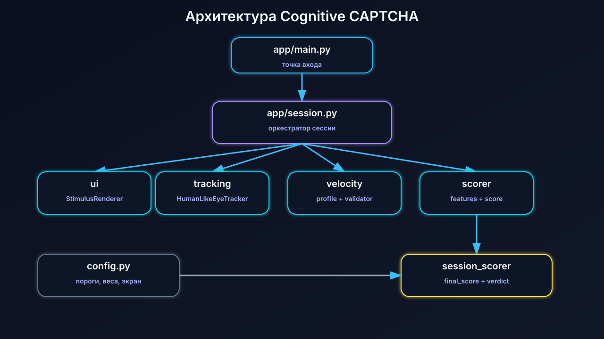
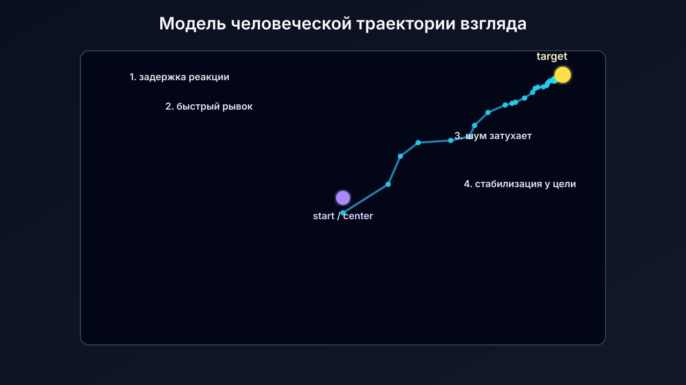
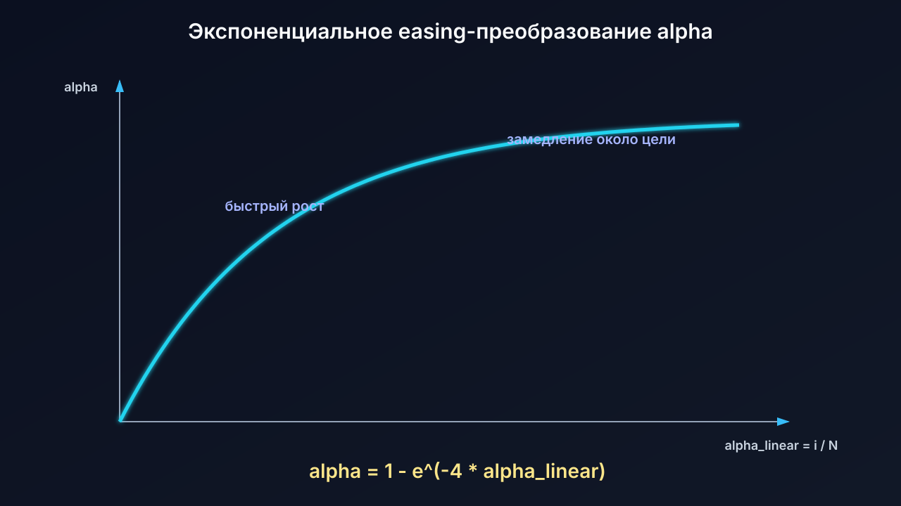
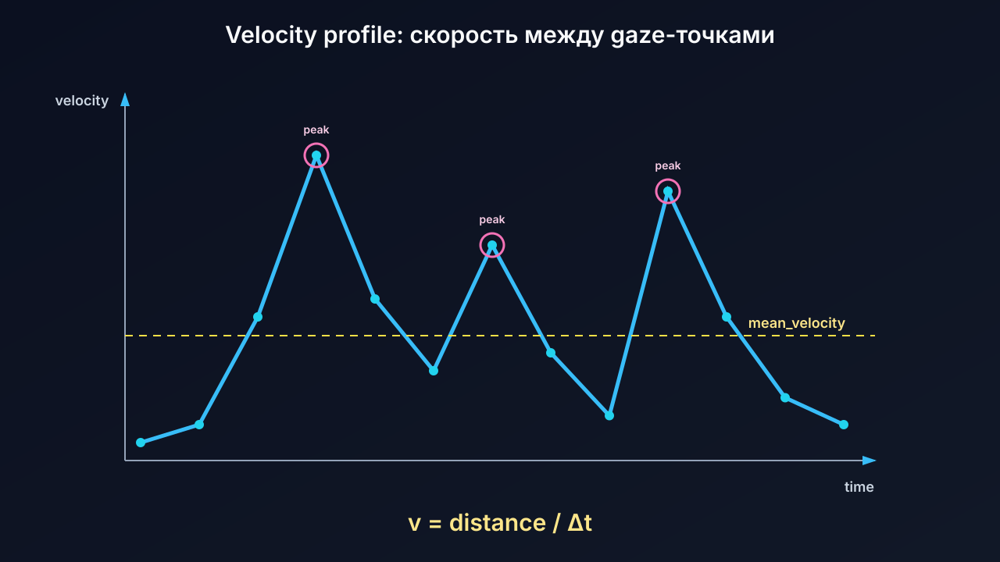

# Cognitive CAPTCHA

## Система CAPTCHA на основе анализа траекторий взгляда

<div class="big accent">Eye-tracking + математический анализ движения</div>

**Дипломный проект**

<!--
Докладчик: кратко представить тему. Главная идея: вместо классического ввода CAPTCHA анализируем поведенческий биометрический сигнал — траекторию взгляда.
-->

---

# Проблема

<div class="two-columns">
<div>

## Классические CAPTCHA

- неудобны для пользователя;
- могут решаться ботами;
- часто проверяют только ответ;
- не анализируют поведение.

</div>
<div>

```text
CAPTCHA challenge
      │
      ▼
 user answer / bot answer
      │
      ▼
 pass / fail
```

</div>
</div>

<!--
Сделать акцент: современные системы распознавания изображений и текста уменьшают надежность классических CAPTCHA.
-->

---

# Идея проекта

<div class="center">

```text
Появился стимул → пользователь смотрит → собираем gaze_points → анализируем → verdict
```

</div>

## Основная гипотеза

**Человеческое движение взгляда имеет характерные признаки:** задержку реакции, нелинейность, шум, саккады, стабилизацию около цели.

<!--
Объяснить простыми словами: бот может сгенерировать координаты, но сложно сделать траекторию, похожую на естественную человеческую.
-->

---

# Координаты взгляда на экране



<!--
Объяснить: экран — пиксельная сетка. Точка взгляда — координаты x, y и время t.
-->

---

# Что такое `gaze_points`

```text
gaze_points = [
  (x0, y0, t0),
  (x1, y1, t1),
  ...,
  (xn, yn, tn),
]
```

- `x` — горизонтальная координата взгляда;
- `y` — вертикальная координата взгляда;
- `t` — время измерения;
- последовательность точек образует траекторию.

<!--
Этот слайд нужен, чтобы комиссия понимала базовый тип данных всего проекта.
-->

---

# Архитектура проекта



<!--
Пояснить слои: app управляет сессией, ui показывает стимул, tracking отдаёт точки, analysis принимает решение.
-->

---

# Основной pipeline программы

```text
1. Показать стимул
2. Собрать gaze_points
3. Построить velocity profile
4. Проверить правдоподобие динамики
5. Посчитать признаки
6. Получить score стимула
7. Агрегировать score сессии
8. Вернуть verdict
```

<!--
Это общий сценарий работы CognitiveCaptchaSession.
-->

---

# Модель человеческой траектории



<!--
Показать, что движение не прямое и не равномерное: реакция, рывок, шум, стабилизация.
-->

---

# `HumanLikeEyeTracker`

```python
class HumanLikeEyeTracker:
    def __init__(reaction_delay_range=(0.2, 0.45),
                 noise_level=25,
                 points=25)

    def collect(start_time, duration, target):
        return [(x, y, t), ...]
```

## Назначение

Создать синтетическую траекторию взгляда, похожую на человеческое движение от центра экрана к целевому стимулу.

---

# Математика симуляции взгляда

```text
alpha_linear_i = i / N
alpha_i = 1 - e^(-4 * alpha_linear_i)
noise_scale_i = (1 - alpha_i) * noise_level

x_i = x_start + alpha_i * (x_target - x_start) + noise_x_i
y_i = y_start + alpha_i * (y_target - y_start) + noise_y_i
t_i = start_time + reaction_delay + i * (duration / N)
```

<!--
Объяснить каждую часть: дискретизация, вектор к цели, экспоненциальный прогресс, затухающий шум.
-->

---

# Почему используется экспонента



<!--
Идея: в начале движение быстрое, ближе к цели изменения меньше. Это лучше, чем линейное равномерное движение.
-->

---

# Velocity analysis



<!--
Скорость считается между соседними точками. Пики скорости позволяют отличить более естественную динамику от слишком ровной.
-->

---

# Признаки скоринга


<!--
Пояснить четыре признака: latency, distance_error, angle_error, out_of_bounds_ratio.
-->

---

# Итоговое решение

```text
stimulus_scores = [s1, s2, s3, s4]

final_score = mean(stimulus_scores)

if final_score >= SESSION_THRESHOLD:
    verdict = HUMAN
else:
    verdict = BOT / FAIL
```

<div class="center big accent">Score превращает траекторию в решение</div>

---

# Что уже реализовано

- Ядро CAPTCHA-сессии;
- симулятор человеческого взгляда;
- velocity profile и velocity validation;
- четыре признака скоринга;
- session-level aggregation;
- подробная документация архитектуры и математики.

---

# Ограничения текущего этапа

- Пока используется симулятор, а не реальный eye-tracker;
- UI временный и консольный;
- velocity validation основан на эвристиках;
- нет большого датасета реальных пользователей;
- нет ML-классификатора;
- нет production-защиты от replay/подмены данных.

---

# Дальнейшее развитие

```text
OpenCV / MediaPipe eye-tracking
        │
        ▼
реальный сбор gaze_points
        │
        ▼
улучшение velocity-фильтра
        │
        ▼
ML-классификация и метрики FAR / FRR / ROC-AUC
        │
        ▼
web-интерфейс и server-side verification
```

---

# Итог

## В проекте реализовано ядро интеллектуальной CAPTCHA

**Главная ценность:** система анализирует не только ответ пользователя, а динамику его поведения — траекторию взгляда во времени.

<div class="center big accent">Спасибо за внимание!</div>
